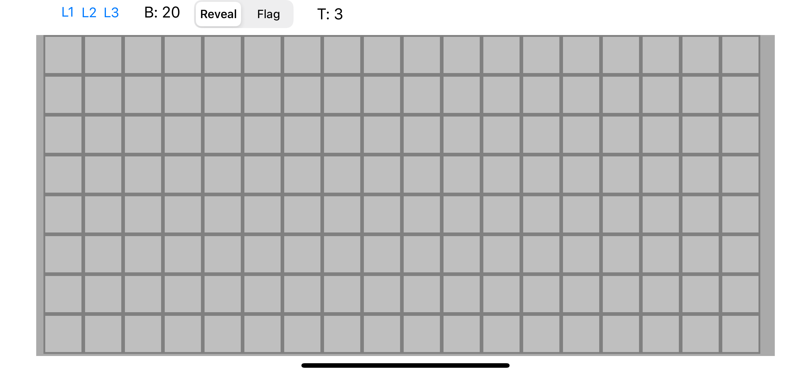
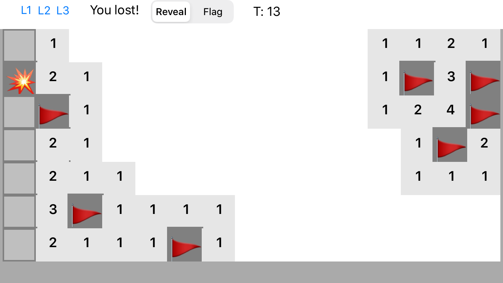
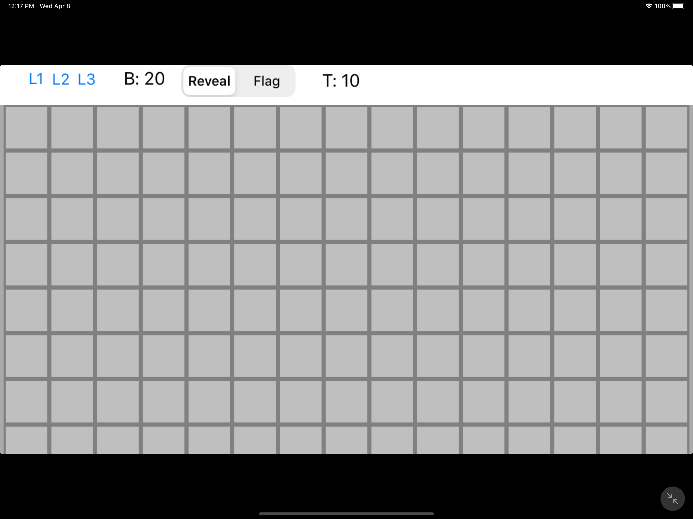
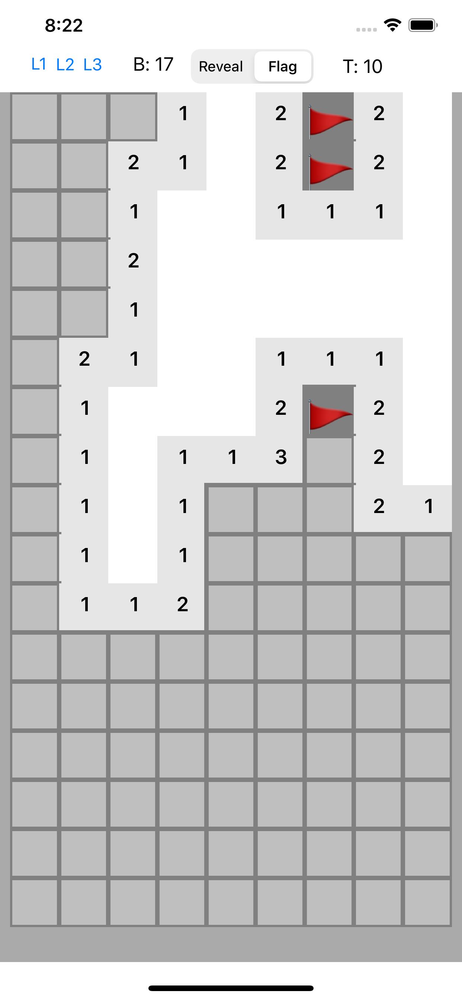
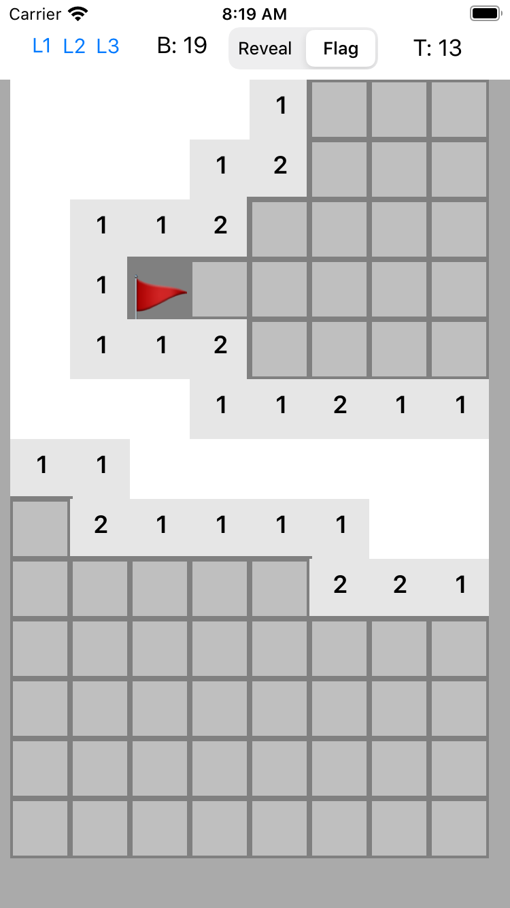
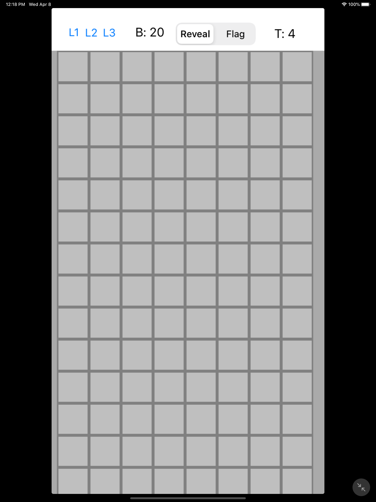

# Minesweeper

HW3-Minesweeper in-Swift

| Mode\Phone | ## IPhone 11                        | ## IPhone 8                       | ## IPad Pro                      |
|------------|-------------------------------------|-----------------------------------|----------------------------------|
| Landscape  |  |  |  |
| Portrait   |   |   |   |

Features: 
* Can add flags
* Once selected table is cleared out recursively
* 3 difficulties
* time is being measured
* game state validation (whether game is over or not)
* numbers are correct
* mines and flags are pictures 
* responsive design